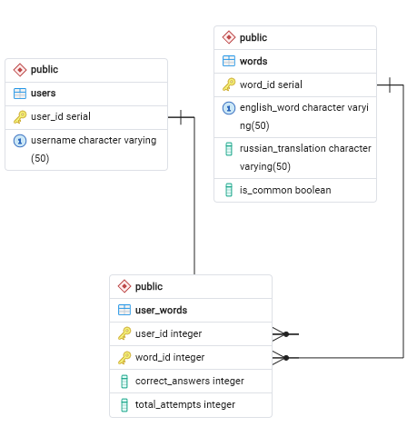

# Приложение для изучения английского языка EnglishCard

Веб-приложение для изучения английских слов, разработанное в рамках курсовой работы. Позволяет пользователям изучать слова, добавлять новые, удалять текущие и отслеживать статистику.

## Требования к ПО
* **Язык программирования:** Python 3.12+
* **База данных:** PostgreSQL
* **Фреймворк:** Streamlit

## Настройка Базы Данных

1. В СУБД PostgreSQL (например, через PgAdmin) необходимо создать пустую базу данных `english_card_db`.
2. База данных инициализируется автоматически: при первом запуске приложения скрипт сам создаст все необходимые таблицы и заполнит базу стартовым набором общих слов (выполнять SQL-запросы вручную не требуется).

### Схема базы данных
В проекте реализовано 3 таблицы со связью "многие ко многим". Для оптимизации потребления ресурсов используется логическое разделение на общие и персональные слова:
* `users` — таблица зарегистрированных пользователей.
* `words` — таблица словаря (включает флаг `is_common` для идентификации базовых слов, доступных всем).
* `user_words` — промежуточная таблица. Хранит статистику ответов пользователя и связи только с теми словами, которые пользователь добавил лично.



## Установка и запуск проекта

1. Склонируйте репозиторий на локальный компьютер:
```bash
git clone [https://github.com/ВАШ_ЛОГИН/ИМЯ_РЕПОЗИТОРИЯ.git](https://github.com/ВАШ_ЛОГИН/ИМЯ_РЕПОЗИТОРИЯ.git)
```

2. Перейдите в папку проекта, создайте и активируйте виртуальное окружение:
```bash
python -m venv venv

# Команда для Windows:
venv\Scripts\activate

# Команда для Linux/Mac:
source venv/bin/activate
```

3. Установите необходимые зависимости:
```bash
pip install -r requirements.txt
```

4. Запустите веб-интерфейс приложения:
```bash
streamlit run main.py
```
